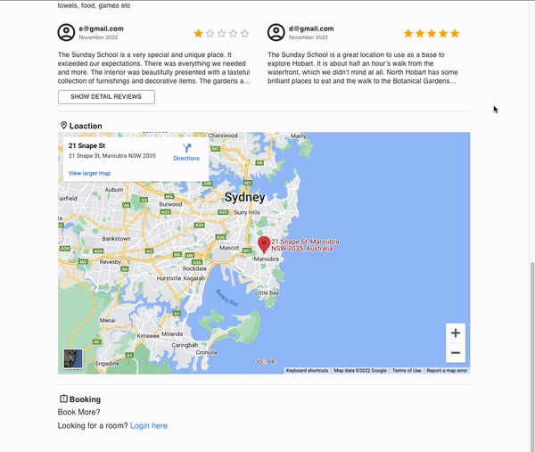

Bonus Works
---

* [Listing] add skeleton into loading landing and listing page
    * Fetching and parsing data is time consuming, the frontend supported skeleton for better user experience and notify user is loading state
    
    

* [Booking] add delete booking
    
* [General] login back to previous page
    * Local has saving state mechanism, which enable user to login the system and redirect to previous viewing listing
    
* [Listing] map location
    Provide embeeded map to show location information
    
* [Booking] list all booked listing
    * Provide "My Booking" Page in Navigation bar for logged in user to view all booked listing (except those listings unpublished by the owner)
    
* [Booking] prevent user to have repetitive availabilty range
    * System will check user has existing availabilty in same listing to prevent repetitive availabilty range 
    